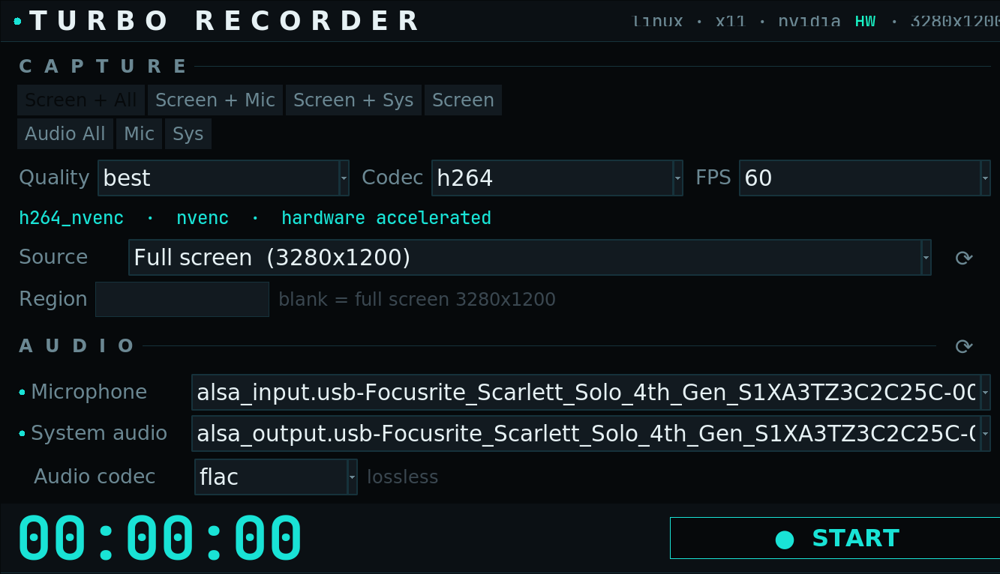

<div align="center">

# 🎬 Turbo Recorder

#### State-of-the-art screen &amp; audio recorder — Linux · macOS · Windows

[](https://github.com/cristiancmoises/turborec/releases/latest)
[](LICENSE)
[](#)
[](https://ffmpeg.org)



📺 **[Watch a sample recording](https://youtu.be/mlf531Da9Qo?si=RTaSB9dJ4NSbGsOm)** &nbsp;·&nbsp; 🪞 also mirrored on [Forgejo](https://git.securityops.co/securityops/turborec)

</div>

Turbo Recorder captures your screen and audio at the **best quality your hardware
can deliver**. It probes your machine and configures everything automatically —
operating system, display server, CPU vendor, GPU, the best hardware video
encoder, screen resolution, and your microphone + system-audio sources — then
builds a **real-time, correct-speed** FFmpeg pipeline and records.

### ✨ Highlights

- 🎯 **Zero config** — auto-detects OS, CPU, GPU, encoder, screen, mic & system audio
- ⚡ **Hardware accelerated** — NVENC · Quick Sync · VAAPI · AMF · VideoToolbox, with automatic CPU fallback
- 🎞️ **Real-time, correct-speed capture** — constant frame rate, so recordings never play back in slow motion
- 🌊 **Wayland _and_ X11** — wlroots (sway/Hyprland/river) capture via `wf-recorder`, with perfectly A/V-synced mic+system audio
- 🖥️ **OBS-style capture** — full screen, a specific monitor, a window, or an exact region
- 🎚️ **You choose** — CPU or GPU encoding · H.264 / H.265 / AV1 · lossless FLAC (or AAC/Opus) audio
- 🖤 **Beautiful dark GUI _and_ a powerful CLI** — packaged as `.deb` / `.rpm` / AppImage

Two front-ends, one engine:

| Tool | Platforms | Interface |
|------|-----------|-----------|
| **`turborec`** | Linux · macOS · Windows | Cross-platform **CLI + GUI** (Python, no extra deps) |
| **`turborecorder`** | Linux (X11) | Fast, dependency-light **Bash CLI** |

## Documentation

- 📖 **[Complete User Guide / Tutorial](docs/TUTORIAL.md)** — install, GUI & CLI
  walkthroughs, capture modes, monitor/window capture, CPU vs GPU, audio, timed
  recording, a recipe cookbook, quality tips, troubleshooting and FAQ.
- 📝 **[Changelog](CHANGELOG.md)** — what changed in each release.

New here? Start with the [60-second quick start](docs/TUTORIAL.md#2-60-second-quick-start).

## Install

**Packages** (built automatically on each `v*` tag via GitHub Actions — see the
[Releases](https://github.com/cristiancmoises/turborec/releases) page):

```bash
# Debian / Ubuntu
sudo apt install ./turborec_3.0.0_all.deb

# Fedora / RHEL / openSUSE
sudo dnf install ./turborec-3.0.0-1.noarch.rpm

# Any Linux — portable, no install
chmod +x Turbo_Recorder-3.0.0-x86_64.AppImage
./Turbo_Recorder-3.0.0-x86_64.AppImage
```

Packages install `turborec` and `turborecorder` to `/usr/bin`, plus a desktop
launcher and icon. Runtime needs: `ffmpeg`, `python3` (≥ 3.8), `python3-tk`
(`python3-tkinter` on Fedora) for the GUI, and — **on a Wayland session** —
[`wf-recorder`](https://github.com/ammen99/wf-recorder) for screen capture
(`sudo apt install wf-recorder` · `sudo dnf install wf-recorder` ·
`guix install wf-recorder`).

**From source** (no packaging needed):

```bash
git clone https://github.com/cristiancmoises/turborec
cd turborec
python3 turborec.py gui      # or: detect / record / devices
```

**Build the packages yourself** — scripts live in [`packaging/`](packaging/):

```bash
packaging/build-deb.sh        # → dist/turborec_3.0.0_all.deb  (works even without dpkg-deb)
packaging/build-rpm.sh        # → dist/turborec-3.0.0-1.noarch.rpm
packaging/build-appimage.sh   # → dist/Turbo_Recorder-3.0.0-x86_64.AppImage
```

## The GUI

A focused dark interface (near-black background, cyan accents) that surfaces the
auto-detected hardware up top and keeps every control one click away:

- Segmented **capture mode** selector and a live **FFmpeg command preview**
- **Source** picker (OBS-style): full screen, a specific monitor, or a window — with refresh
- **Encoder** selector: Auto · GPU · CPU
- Microphone / system-audio pickers with presence dots, and a re-probe button
- A prominent **Start / Stop** with a live elapsed timer, pulsing REC indicator,
  and running output-file size
- Output folder picker with a live filename preview

Launch it with `turborec gui` (or just `turborec` on a desktop session).

## Automatic detection

Both front-ends auto-detect and configure:

- **Operating system & display server** — X11 (`x11grab`), **Wayland/wlroots**
  (`wf-recorder`: sway, Hyprland, river), macOS Quartz, Windows GDI
- **CPU vendor** — Intel / AMD / Apple Silicon
- **GPU & best hardware encoder**, in priority order:
  - **NVIDIA** → NVENC (`h264_nvenc` / `hevc_nvenc` / `av1_nvenc`)
  - **Intel** → Quick Sync (`*_qsv`) or VAAPI on Linux
  - **AMD** → AMF on Windows, VAAPI on Linux
  - **Apple** → VideoToolbox
  - **No GPU?** → high-quality software `libx264` / `libx265` automatically
- **Screen resolution** — captured at native size (no upscaling)
- **Microphone** and **system-audio (loopback/monitor)** sources

## Quality

- Quality presets (`best`/`high`/`balanced`/`compact`) mapped to real-time-capable
  parameters for each encoder (NVENC `p4`–`p6` + constant-quality VBR + spatial AQ,
  QSV/VAAPI constant-quality, x264 `veryfast`/`ultrafast` + CRF).
- BT.709 color metadata for faithful color reproduction.
- Lossless **FLAC** audio by default (AAC 320k / Opus 256k optional), high-quality
  **soxr** resampler, automatic mic-channel detection, and clean mic + system mixing.
- **Real-time, correct-speed capture:** presets are tuned to sustain live capture
  and the output is forced to constant frame rate, so recordings always play back
  at the right speed (no slow-motion) and stay smooth even at high resolution/fps.

---

## Cross-platform CLI + GUI — `turborec.py`


**Requirements:** Python 3.8+ and FFmpeg on `PATH`. The GUI also needs Tk —
bundled with the python.org installers on macOS/Windows; `sudo apt install
python3-tk` on Debian/Ubuntu. On a **Wayland** session, screen capture uses
[`wf-recorder`](https://github.com/ammen99/wf-recorder) (install it from your
package manager).

```bash
# See exactly what was auto-detected on this machine
python3 turborec.py detect

# Launch the graphical interface
python3 turborec.py gui

# Record screen + microphone + system audio at best quality (default)
python3 turborec.py record

# Pick a mode / quality / fps / codec
python3 turborec.py record -m video_mic -q high -f 30 -c hevc

# Lossless audio-only (mic + system mixed)
python3 turborec.py record -m audio_both --audio-codec flac

# Record for a fixed time, then open the file when done
python3 turborec.py record -m video_both -t 60 --countdown 3 --open

# Choose the encoder backend: auto (default), GPU (hardware), or CPU (software)
python3 turborec.py record --gpu          # force hardware (NVENC/QSV/VAAPI/AMF/VideoToolbox)
python3 turborec.py record --cpu          # force software (libx264/x265)

# OBS-style: capture a specific monitor, a window, or an exact region
python3 turborec.py targets               # list screen / monitors / windows
python3 turborec.py record --monitor HDMI-0
python3 turborec.py record --window "My Browser"
python3 turborec.py record --region 1280x720+100+50

# List input devices / encoders; machine-readable detection
python3 turborec.py devices
python3 turborec.py encoders
python3 turborec.py detect --json

# Preview the FFmpeg command without recording
python3 turborec.py record --dry-run
```

Subcommands: `detect` (`--json`), `record`, `gui`, `devices`, `encoders`, `targets`.
Modes: `video_both`, `video_mic`, `video_system`, `video_only`,
`audio_both`, `audio_mic`, `audio_system`.

Stop a recording with **`q`** or **Ctrl-C** (the file is finalized cleanly), or
use `-t/--duration` for a fixed length. Everything is overridable
(`--mic-device`, `--system-device`, `--region`, `--software`, `--open`,
`--countdown`, …) and defaults can be saved in a JSON config (`--config`, or
`$TURBOREC_CONFIG` / `~/.config/turborec/config.json`). Run
`python3 turborec.py record -h` for the full list.

---

## Linux Bash recorder — `turborecorder`

A fast, dependency-light path for X11 systems.

**Requirements:** FFmpeg (with VAAPI and/or NVENC), `xrandr`/`xdpyinfo`,
PulseAudio or PipeWire (`pactl`).

### Install

```bash
chmod +x turborecorder
sudo mv turborecorder /usr/local/bin/   # optional
```

### Usage

```bash
./turborecorder                       # interactive menu
./turborecorder -m video_both -Q best # screen + mic + system audio, best quality
./turborecorder -m video_mic -C hevc -f 30
./turborecorder -S                    # force software encoding
./turborecorder -h                    # all options
```

Audio sources are auto-detected from your default sink/source; override with
`MONITOR_SOURCE=` / `MIC_SOURCE=` environment variables if needed.

## License

GPL-3.0 — see [LICENSE](LICENSE).
