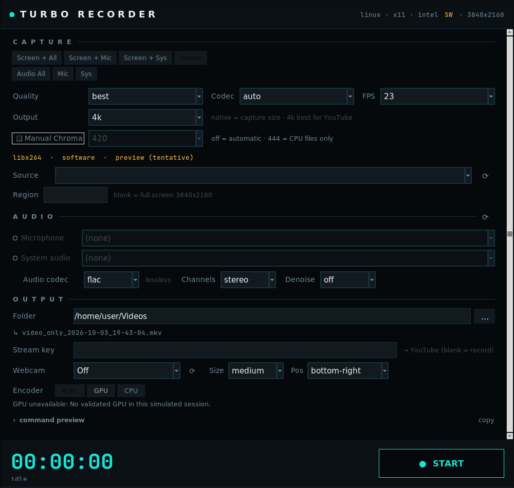

<div align="center">

# 🎬 Turbo Recorder

#### State-of-the-art screen &amp; audio recorder — Linux · macOS · Windows · BSD · Guix

[](https://github.com/cristiancmoises/turborec/releases/latest)
[](LICENSE)
[](#)
[](https://ffmpeg.org)



🌐 **[Official website](https://turborec.securityops.co)** &nbsp;·&nbsp;
📺 **[Watch a sample recording](https://youtu.be/mlf531Da9Qo?si=RTaSB9dJ4NSbGsOm)** &nbsp;·&nbsp;
🪞 also mirrored on [Forgejo](https://git.securityops.com.br/cristiancmoises/turborec)

</div>

Turbo Recorder captures your screen and audio at the **best quality your hardware
can deliver**. It probes your machine and configures everything automatically —
operating system, display server, CPU vendor, GPU, the best available video
codec and encoder, screen resolution, and your microphone + system-audio sources — then
builds a **real-time, correct-speed** FFmpeg pipeline and records.

The ready-to-record profile is quality-first: **Best** quality, **Auto** codec,
**23 fps**, and **4K (3840×2160)** output. Auto uses the most efficient usable
hardware codec in this order: **AV1 → HEVC → H.264**. If hardware encoding is
not available, Turbo Recorder falls back safely to software H.264. You can
override every choice in the GUI, CLI, or JSON configuration.

> **v3.9.1 portability release:** FreeBSD, OpenBSD, NetBSD and DragonFly are now
> identified separately. X11 keeps the existing `x11grab` targets; XWayland can
> capture the screen/region exposed by its compatibility server. Audio and
> cameras are offered only when the local FFmpeg build and real device nodes
> support them.

### ✨ Highlights

- 🎯 **Zero config** — auto-detects OS, CPU, GPU, encoder, screen, mic & system audio
- 🧩 **Safe automatic mode** — uses mic + system audio when available and
  gracefully falls back to mic, loopback, or video-only when a source is absent
- ⚡ **Hardware accelerated** — NVENC · Quick Sync · VAAPI · AMF · VideoToolbox, with automatic CPU fallback
- 💎 **Quality-first defaults** — Best quality · Auto codec · 23 fps · 4K output, ready from the first launch
- 🎞️ **Real-time, correct-speed capture** — constant frame rate, so recordings never play back in slow motion
- 🌊 **Linux Wayland _and_ X11** — wlroots (sway/Hyprland/river) capture
  via `wf-recorder`, with perfectly A/V-synced mic+system audio; BSD uses
  X11/XWayland
- 🖥️ **OBS-style capture** — full screen, a specific monitor, a window, or an exact region
- 🎚️ **Smart or manual codec choice** — Auto prefers hardware AV1 → HEVC → H.264; explicit H.264 / H.265 / AV1 and CPU/GPU controls remain available
- 🔊 **Fix one-sided audio** — clone a live channel to both sides (`--audio-channels left/right/mono`)
- 📐 **Record in 720p / 1080p / 1440p / 4K** — `-R 4k` upscales any screen to true 4K, so YouTube serves its high-bitrate 4K tier
- 📡 **Go live to YouTube (OBS-style)** — paste your stream key (`--stream KEY` or the GUI field) and stream; keys are always redacted from output
- 🎥 **Webcam overlay (picture-in-picture)** — overlay your camera on the recording *or* stream, with your choice of device, size and corner (`--camera`)
- 🔇 **Built-in noise suppression** — NoiseTorch-style mic denoise (`--denoise light/medium/strong`), no extra app or virtual device needed
- 🧠 **Adaptive quality** — presets scale with the pixel rate: best-quality at 1080p, fast enough to stay real-time at 4K
- 🪟 **Reliable Windows capture** — Unicode microphones/cameras, stable DirectShow
  device IDs, multi-monitor layouts, and native window handles
- 🐡 **Native BSD audio discovery** — sndio on OpenBSD and OSS on
  FreeBSD/NetBSD/DragonFly, with optional PulseAudio monitor sources for desktop
  sound and no fabricated devices
- 📦 **Zero-install Windows app** — a single `.exe` with Python, Tk **and FFmpeg bundled in**: download, double-click, record. The classic **setup.exe installer bundles Python 3.12, Tk and FFmpeg too**, so it needs nothing pre-installed either
- 🖤 **Beautiful dark GUI _and_ a powerful CLI** — packaged as `.deb` / `.rpm` / AppImage / FreeBSD `.pkg` / Guix pack / Windows `.exe` / portable tarball

Two front-ends, one engine:

| Tool | Platforms | Interface |
|------|-----------|-----------|
| **`turborec`** | Linux · macOS · Windows · BSD | Cross-platform **CLI + GUI** (Python standard library; FFmpeg capture engine) |
| **`turborecorder`** | Linux (X11 **&amp; Wayland**) | Fast, dependency-light **Bash CLI** |

## Documentation

- 📖 **[Complete User Guide / Tutorial](docs/TUTORIAL.md)** — install, GUI & CLI
  walkthroughs, capture modes, monitor/window capture, CPU vs GPU, audio, timed
  recording, a recipe cookbook, quality tips, troubleshooting and FAQ.
- 🇧🇷 **[Documentação completa em português do Brasil](docs/README.pt-BR.md)** —
  instalação, permissões do Windows, dispositivos, exemplos e diagnóstico.
- 📝 **[Changelog](CHANGELOG.md)** — what changed in each release.

New here? Start with the [60-second quick start](docs/TUTORIAL.md#2-60-second-quick-start).

## How Turbo Recorder compares

How it stacks up against the usual screen-capture / streaming tools. Turbo
Recorder's goal is to be the **all-in-one recorder + streamer** that just works
with zero setup — not a video editor (use Kdenlive for that) and not a
scene-compositing studio you configure by hand (OBS).

| Capability | **Turbo Recorder** | OBS Studio | Kdenlive | SimpleScreenRecorder | Kazam / vokoscreen |
|---|:---:|:---:|:---:|:---:|:---:|
| Zero-config (auto-detect encoder + devices) | ✅ | ⚠️ manual scenes | ➖ | ⚠️ | ⚠️ |
| Hardware encoding (NVENC/QSV/VAAPI/AMF/VT) | ✅ | ✅ | ✅ | ✅ | ⚠️ |
| Screen / monitor / window / region capture | ✅ | ✅ | ➖ import | ✅ | ⚠️ |
| **Webcam overlay (picture-in-picture)** | ✅ | ✅ | ✅ (edit) | ❌ | ❌ |
| **Live streaming (RTMP / YouTube)** | ✅ | ✅ | ❌ | ❌ | ❌ |
| **Built-in mic noise suppression** | ✅ | ⚠️ plugin | ⚠️ effect | ❌ | ❌ |
| Native Linux **Wayland** (wlroots) capture | ✅ | ⚠️ portal | ⚠️ | ❌ X11 | ⚠️ |
| **Scriptable CLI** (automation / cron) | ✅ | ❌ | ❌ | ❌ | ❌ |
| Modern GUI | ✅ | ✅ | ✅ | ✅ | ✅ |
| Cross-platform (Linux · macOS · Windows · **BSD**) | ✅ | ⚠️ no BSD | ✅ | ⚠️ Linux | ❌ Linux |
| Lossless audio (FLAC) | ✅ | ⚠️ | ✅ | ⚠️ | ❌ |
| Install footprint | **one portable app/package** | large | very large | small | small |
| Self-contained Windows app (`.exe` and setup installer bundle Python + Tk + FFmpeg) | ✅ | ⚠️ installer | ⚠️ installer | ⚠️ | ❌ |
| Video editing / timeline | ❌ *(records only)* | ❌ | ✅ | ❌ | ❌ |

<sub>✅ built-in · ⚠️ partial / manual / plugin · ➖ not applicable · ❌ not available. Comparison reflects typical out-of-the-box use.</sub>

### Why Turbo Recorder is the best choice for recording & streaming

- **It just works — zero configuration.** OBS makes you build scenes, add
  sources, and pick encoders; SimpleScreenRecorder and Kazam still ask you to
  wire up audio. Turbo Recorder **probes your machine** (OS, display server,
  CPU/GPU, the best usable codec/encoder, screen resolution, mic and
  system-audio devices) and configures a quality-first pipeline automatically.
  One command records; one field goes live.
- **All-in-one, but focused.** Screen + webcam overlay + mic/system audio +
  noise suppression + YouTube streaming — the things you actually need for
  tutorials, gameplay, demos and meetings — in a **single ~1-file tool**, not a
  100 MB studio or a video-editing suite.
- **True Linux Wayland support.** OBS relies on the desktop portal and Simple­Screen­Recorder
  is X11-only; Turbo Recorder captures wlroots compositors (sway/Hyprland/river)
  natively via `wf-recorder`, with perfectly A/V-synced audio.
- **Scriptable.** A real CLI means you can record from a keybind, a cron job, or
  CI — impossible with the GUI-only tools.
- **Runs everywhere, installs anywhere.** Linux (`.deb`/`.rpm`/AppImage/Guix),
  the BSDs (`.pkg`/tarball), macOS, and a **self-contained Windows `.exe`** with
  Python + Tk + FFmpeg bundled in — download and run, nothing else to install.
- **Best-quality by default & security-minded.** Adaptive encoder tuning per
  resolution, a 23 fps / 4K quality-first profile, automatic codec selection,
  lossless FLAC audio, BT.709 color — and stream keys are always redacted.

When you need a **timeline editor**, reach for Kdenlive; when you need a
**broadcast studio** with dozens of composited sources and transitions, OBS is
purpose-built for that. For **fast, high-quality screen/webcam recording and
one-click streaming with nothing to configure**, Turbo Recorder is the best fit.

### Under the hood — what powers it

Turbo Recorder is a thin, quality-first orchestration layer over battle-tested,
free/open-source building blocks — no reinventing the wheel:

- **[FFmpeg](https://ffmpeg.org)** — the encoding/streaming engine (H.264/H.265/AV1, AAC/FLAC/Opus, the `overlay`/`afftdn` filters, RTMP/FLV).
- **[wf-recorder](https://github.com/ammen99/wf-recorder)** — native Linux
  wlroots/Wayland screen capture; **x11grab / gdigrab / AVFoundation** on
  Linux/BSD X11 or XWayland / Windows / macOS.
- **Hardware encoders** — NVIDIA **NVENC**, Intel **Quick Sync**, **VAAPI**, AMD **AMF**, Apple **VideoToolbox**, with automatic `libx264`/`libx265` fallback.
- **PipeWire / PulseAudio** — Linux mic + system-audio capture and the synced
  combined source; BSD uses FFmpeg's native **sndio/OSS** inputs and can use an
  available Pulse monitor for system audio. **V4L2 / AVFoundation / DirectShow**
  provide webcam capture where the platform and FFmpeg expose them.
- **RNNoise-style denoise** via FFmpeg **`afftdn`** — the same problem NoiseTorch solves, without the extra daemon.
- **Python standard library + Tk** only — no pip dependencies. Two front-ends over one engine: the cross-platform `turborec` (CLI + GUI) and the lightweight `turborecorder` (Bash, X11 + Wayland).

### How it boosts your productivity

- **From idea to recording in seconds** — no scene setup, no device wiring, no
  encoder guessing. `turborec` (or one GUI click) and you're capturing.
- **One tool, one workflow, everywhere** — the same commands and muscle memory on
  Linux, macOS, Windows and BSD; onboard a teammate with a single download.
- **Automate it** — bind recording to a hotkey, script demo captures in CI, or
  schedule a stream; the CLI + JSON config (`~/.config/turborec/config.json`)
  make your defaults reproducible across machines.
- **Ship better content faster** — webcam overlay + built-in noise suppression +
  hardware-encoded best-quality output mean fewer retakes and no post-processing
  just to make a tutorial or demo look and sound professional.
- **Go live without a studio** — paste a stream key and broadcast to YouTube
  (camera and clean audio included) straight from the same tool you record with.

## Install

**Packages** (built automatically on each `v*` tag via GitHub Actions — see the
[Releases](https://github.com/cristiancmoises/turborec/releases) page):

```bash
# Debian / Ubuntu
sudo apt install ./turborec_3.9.1_all.deb

# Fedora / RHEL / openSUSE
sudo dnf install ./turborec-3.9.1-1.noarch.rpm

# Any Linux — portable, no install
chmod +x Turbo_Recorder-3.9.1-x86_64.AppImage
./Turbo_Recorder-3.9.1-x86_64.AppImage

# FreeBSD — native package
pkg add ./turborec-3.9.1.pkg

# Any Unix (BSD / illumos / Linux / macOS) — portable tarball
tar xzf turborec-3.9.1.tar.gz && cd turborec-3.9.1
sudo ./install.sh            # installs to /usr/local (PREFIX=… to change)

# GNU Guix — relocatable pack (any distro, unprivileged) or the package file
tar xf turborec-3.9.1-guix-x86_64.tar.gz -C /   # unpacks /gnu/store + /bin
guix package -f guix.scm                        # or install from the repo

# Windows — self-contained: Python, Tk AND ffmpeg bundled, nothing to install
Turbo_Recorder-3.9.1-windows-x64.exe gui          # zero-install portable app
Turbo_Recorder-3.9.1-windows-x64-setup.exe        # classic installer (also bundles
                                                  #   Python 3.12 + Tk + FFmpeg)
```

The Guix definition includes Python's `tk` output and validates that `_tkinter`
imports, so both the local package and relocatable pack are intended to run the
GUI. CI performs this build/import validation headlessly; it is not presented as
a visual GUI or physical capture-device test.

Packages install `turborec` and `turborecorder` to `/usr/bin` (`/usr/local/bin`
for the BSD/tarball route), plus a desktop launcher and icon. Runtime needs:
`ffmpeg`, `python3` (≥ 3.8), and `python3-tk` (`python3-tkinter` on Fedora) for
the GUI. Linux Pulse/PipeWire discovery uses `pactl` (`pulseaudio-utils`). On
BSD, microphone capture uses a native FFmpeg sndio or OSS input when its real
device node is available; `pactl` is optional and is needed only to discover a
PulseAudio monitor for desktop/system sound. On a **Linux Wayland session**, install
[`wf-recorder`](https://github.com/ammen99/wf-recorder) for screen capture
(`sudo apt install wf-recorder` · `sudo dnf install wf-recorder` ·
`guix install wf-recorder`). BSD screen capture uses X11 or XWayland. On
**FreeBSD**: `pkg install python3 ffmpeg`; on **OpenBSD**:
`pkg_add python3 ffmpeg`.

Fedora's `ffmpeg-free` can lack `libx264`, so Turbo Recorder 3.9.1 falls through
to `libopenh264` only after a real one-frame initialization succeeds; Fedora's
listed-but-unusable `noopenh264` shim is rejected even when general encoder
probes are disabled. A normal enabled Cisco OpenH264 repository lets
`sudo dnf install ffmpeg-free` pull the real library. If the stub is already
installed, enable `fedora-cisco-openh264` and run
`sudo dnf swap noopenh264 openh264`.

**From source** (no packaging needed):

```bash
git clone https://github.com/cristiancmoises/turborec
cd turborec
python3 turborec.py gui      # or: detect / record / devices
```

**Build the packages yourself** — scripts live in [`packaging/`](packaging/):

```bash
packaging/build-deb.sh        # → dist/turborec_3.9.1_all.deb  (works even without dpkg-deb)
packaging/build-rpm.sh        # → dist/turborec-3.9.1-1.noarch.rpm
packaging/build-appimage.sh   # → dist/Turbo_Recorder-3.9.1-x86_64.AppImage
packaging/build-tarball.sh    # → dist/turborec-3.9.1.tar.gz   (portable; any Unix incl. the BSDs)
packaging/build-freebsd-pkg.sh # → dist/turborec-3.9.1.pkg      (run on FreeBSD; pkg add)
packaging/build-source-tarball.sh # → dist/turborec-3.9.1-source.tar.gz (complete tracked source)
guix build -f guix.scm        # GNU Guix package (guix pack -RR … for a tarball)
```

> Every release ships **nine platform payloads** — `.deb`, binary/source
> `.rpm`, AppImage, a portable tarball, a FreeBSD `.pkg`, a GNU Guix relocatable
> pack, a Windows `.exe`, and a Windows **setup.exe installer** — plus a complete
> immutable `-source.tar.gz` for downstream packagers and **`SHA256SUMS`**:
> **11 total release assets**, all built and verified by GitHub
> Actions on each `v*` tag. Both Windows artifacts are **fully self-contained** —
> Python, Tk **and FFmpeg are bundled** (the `.exe` inside the binary, the
> installer via a silently-installed Python 3.12), so users just download and run
> (no Python, no FFmpeg, no PATH setup, no admin install for the `.exe`).

## The GUI

A focused dark interface (near-black background, cyan accents) that surfaces the
auto-detected hardware up top and keeps every control one click away:

- Segmented **capture mode** selector and a live **FFmpeg command preview**
- A ready-to-record **Best · Auto codec · 23 fps · 4K** profile
- **Source** picker (OBS-style): full screen, a specific monitor, or a window — with refresh
- **Encoder** selector: Auto · GPU · CPU
- Microphone / system-audio pickers with presence dots, and a re-probe button
- A prominent **Start / Stop** with a live elapsed timer, pulsing REC indicator,
  and running output-file size
- Output folder picker with a live filename preview

Launch it with `turborec gui` (or just `turborec` on a desktop session).

## Automatic detection

Both front-ends auto-detect and configure:

- **Operating system & display server** — Linux, macOS, Windows, **FreeBSD,
  OpenBSD, NetBSD and DragonFly are identified separately**. Linux supports X11
  (`x11grab`) and Wayland/wlroots (`wf-recorder`: sway, Hyprland, river); BSD
  screen capture uses the X11/XWayland `x11grab` path; macOS uses Quartz and
  Windows uses GDI.
- **CPU vendor** — Intel / AMD / Apple Silicon
- **GPU & best codec/encoder** — Auto prefers usable hardware **AV1**, then
  **HEVC**, then **H.264**, and finally software H.264. Within each codec it
  probes the platform backends in priority order:
  - **NVIDIA** → NVENC (`h264_nvenc` / `hevc_nvenc` / `av1_nvenc`)
  - **Intel** → Quick Sync (`*_qsv`) or VAAPI on Linux
  - **AMD** → AMF on Windows, VAAPI on Linux
  - **Apple** → VideoToolbox
  - **No GPU?** → high-quality software `libx264` / `libx265` automatically
- **Screen and capture targets** — native resolution, monitors and windows;
  signed virtual-desktop coordinates on Windows and Linux/BSD X11, and real
  display IDs on macOS
- **Microphone** and **system-audio (loopback/monitor)** sources — Pulse/PipeWire
  on Linux; capability-gated sndio on OpenBSD and OSS on
  FreeBSD/NetBSD/DragonFly. BSD system audio is listed only when a working
  PulseAudio monitor source actually exists.

## Quality

- Quality presets (`best`/`high`/`balanced`/`compact`) mapped to real-time-capable
  parameters for each encoder (NVENC `p4`–`p6` + constant-quality VBR + spatial AQ,
  QSV/VAAPI constant-quality, x264 `veryfast`/`ultrafast` + CRF).
- BT.709 color metadata for faithful color reproduction.
- Lossless **FLAC** audio by default (AAC 320k / Opus 256k optional), high-quality
  **soxr** resampler, automatic mic-channel detection, and clean mic + system mixing.
- **Real-time, correct-speed capture:** presets are tuned to sustain live capture
  and the output is forced to constant frame rate, so recordings always play back
  at the right speed (no slow-motion) and stay smooth even at high resolution/fps.
- **Default recording profile:** Best quality, Auto codec, 23 fps, and exact
  3840×2160 output. Use `-R native`, another FPS, or an explicit codec whenever
  compatibility, file size, or capture load matters more than the default.

---

## Cross-platform CLI + GUI — `turborec.py`


**Requirements:** Python 3.8+ and FFmpeg on `PATH`. The GUI also needs Tk —
bundled with the python.org installers on macOS/Windows; `sudo apt install
python3-tk` on Debian/Ubuntu. On a **Wayland** session, screen capture uses
[`wf-recorder`](https://github.com/ammen99/wf-recorder) (install it from your
package manager).

```bash
# See exactly what was auto-detected on this machine
python3 turborec.py detect

# Launch the graphical interface
python3 turborec.py gui

# Record with the defaults: Best quality, Auto codec, 23 fps and 4K output.
# Automatic capture mode uses every available audio source and safely falls
# back if a mic or loopback device is unavailable.
python3 turborec.py record

# Pick a mode / quality / fps / codec
python3 turborec.py record -m video_mic -q high -f 30 -c hevc

# Lossless audio-only (mic + system mixed)
python3 turborec.py record -m audio_both --audio-codec flac

# Fix sound only on one side (clone that channel to both), e.g. a mono mic on input 2
python3 turborec.py record -m video_mic --audio-channels right   # or left / mono

# Override the defaults explicitly (4K upscales smaller sources)
python3 turborec.py record -R 4k -c hevc -f 23  # also: native / 720p / 1080p / 1440p

# Go live to YouTube (OBS-style) — paste your stream key; it's redacted from all output
python3 turborec.py record -m video_both --stream YOUR_YT_STREAM_KEY
python3 turborec.py record --stream KEY --stream-url rtmps://host/app   # custom RTMP/RTMPS ingest

# Webcam overlay (picture-in-picture) — pick device, size and corner. Works for recording AND streaming
python3 turborec.py cameras                                            # list webcams
python3 turborec.py record -m video_both --camera /dev/video0 --camera-size medium --camera-position bottom-right
python3 turborec.py record --stream KEY --camera /dev/video0 --camera-position top-right   # go live with your cam

# Built-in mic noise suppression (NoiseTorch-style) — applied to the mic only
python3 turborec.py record -m video_mic --denoise medium               # off / light / medium / strong

# Record for a fixed time, then open the file when done
python3 turborec.py record -m video_both -t 60 --countdown 3 --open

# Choose the encoder backend: auto (default), GPU (hardware), or CPU (software)
python3 turborec.py record --gpu          # request hardware (NVENC/QSV/VAAPI/AMF/VideoToolbox)
python3 turborec.py record --cpu          # force software (libx264/x265)

# OBS-style: capture a specific monitor, a window, or an exact region
python3 turborec.py targets               # list screen / monitors / windows
python3 turborec.py record --monitor HDMI-0
python3 turborec.py record --window "My Browser"
python3 turborec.py record --region 1280x720+100+50

# List input devices / encoders; machine-readable detection
python3 turborec.py devices
python3 turborec.py encoders
python3 turborec.py detect --json

# Preview the FFmpeg command without recording
python3 turborec.py record --dry-run
```

Subcommands: `detect` (`--json`), `record`, `gui`, `devices`, `encoders`, `targets`.
Modes: `auto` (default), `video_both`, `video_mic`, `video_system`, `video_only`,
`audio_both`, `audio_mic`, `audio_system`.

Stop a recording with **`q`** or **Ctrl-C** (the file is finalized cleanly), or
use `-t/--duration` for a fixed length — `90`, `90s`, `5m`, `1h30m`, the `1h30`
shorthand for 1h 30m, or `HH:MM:SS`. Everything is overridable
(`--mic-device`, `--system-device`, `--region`, `--software`, `--open`,
`--countdown`, …) and defaults can be saved in a JSON config (`--config`, or
`$TURBOREC_CONFIG` / `~/.config/turborec/config.json`). Run
`python3 turborec.py record -h` for the full list.

### 📡 Live streaming to YouTube

Stream straight from Turbo Recorder — no OBS needed. In **YouTube Studio → Go
live**, copy your **Stream key**, then either paste it into the GUI's **Stream
key** field or pass it on the CLI:

```bash
python3 turborec.py record -m video_both --stream YOUR_YT_STREAM_KEY
```

Turbo Recorder builds a streaming-correct pipeline automatically: **H.264** (CBR
at YouTube's recommended bitrate for your frame size), **AAC** audio, a
**2-second keyframe interval**, and **FLV** over **RTMPS**, while still mixing
mic + system audio. It works on X11, macOS, Windows, and **Wayland** (via
`wf-recorder`). Default ingest is YouTube; override it with `--stream-url` for
another RTMP/RTMPS service (Twitch, a custom server, …). Press **`q`** / **Ctrl-C**
to stop.

> 🔒 Your stream key is a credential: it's **redacted (`••••`) from every command,
> preview, dry-run and status line**. As with any ffmpeg RTMP push, the key is
> visible to other local users via the process list while live — only a concern
> on shared multi-user machines.

### 🎥 Webcam overlay (picture-in-picture)

Overlay your camera on the recording **or** the live stream, OBS-style. List your
cameras, then choose the device, size and corner:

```bash
turborec cameras                                     # list webcams
turborec record -m video_both --camera /dev/video0 --camera-size medium --camera-position bottom-right
turborec record --stream KEY --camera /dev/video0 --camera-position top-right   # go live with your cam
```

- **Device** — `--camera` takes `/dev/videoN` on Linux and on a BSD whose FFmpeg
  has a V4L2 input and exposes a real camera device, an AVFoundation index on
  macOS, or a DirectShow device name on Windows. In the GUI, pick it from the
  **Webcam** dropdown.
- **Size** — `--camera-size` accepts `small` / `medium` / `large` (a fraction of the
  output width), an explicit `WxH`, or `N%`.
- **Position** — `--camera-position` is any corner (`top-left`, `top-right`,
  `bottom-left`, `bottom-right`) or `center`.

The camera is composited and hardware-encoded into the output with the rest of the
frame, on every backend (X11/macOS/Windows and Wayland).

### 🔇 Built-in noise suppression (NoiseTorch-style)

Clean up your microphone with one switch — no NoiseTorch daemon, model file, or
virtual audio device required. It's applied to the **microphone only** (never to
your clean system audio) and works in recordings and streams:

```bash
turborec record -m video_mic --denoise medium       # off | light | medium | strong
```

In the GUI it's the **Denoise** dropdown next to the audio codec. Under the hood
it uses FFmpeg's adaptive `afftdn` denoiser plus a high-pass to remove low rumble.

---

## Linux Bash recorder — `turborecorder`

A fast, dependency-light recorder for both **X11 and Wayland**. It auto-detects
the session: on X11 it captures with `x11grab`; on a **Wayland/wlroots** desktop
(sway, Hyprland, river) it captures with `wf-recorder` — including video + system,
video + mic, and video + **mixed mic&system** (via a PipeWire combined source).

**Requirements:** FFmpeg (with VAAPI and/or NVENC), PulseAudio or PipeWire
(`pactl`); on **X11** also `xrandr`/`xdpyinfo`; on **Wayland** also `wf-recorder`
and `wlr-randr` (or `swaymsg`).

### Install

```bash
chmod +x turborecorder
sudo mv turborecorder /usr/local/bin/   # optional
```

### Usage

```bash
./turborecorder                       # interactive menu
./turborecorder -m video_both -Q best # screen + mic + system audio, best quality
./turborecorder -m video_mic -C hevc -f 30
./turborecorder -S                    # force software encoding
./turborecorder -h                    # all options
```

Audio sources are auto-detected from your default sink/source; override with
`MONITOR_SOURCE=` / `MIC_SOURCE=` environment variables if needed.

## License

GPL-3.0 — see [LICENSE](LICENSE).
